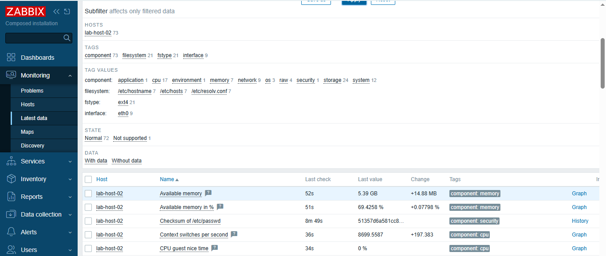
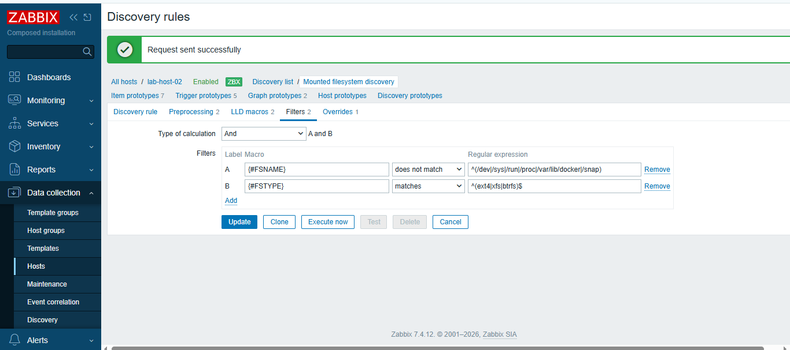
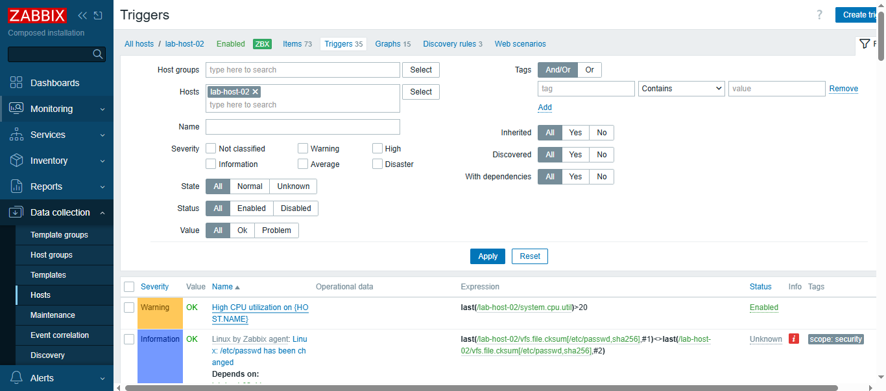
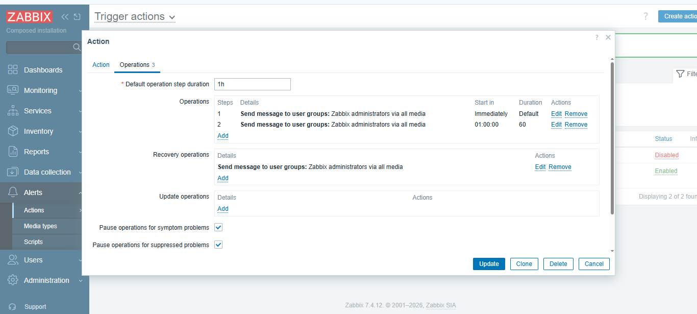

# Zabbix Monitoring Lab — Platform Deep-Dive
**Dinesh Ravichandiran**

Production work at PTC covers alert tuning, triage, and the day-to-day operational side of Zabbix across 50+ Fortune 500 environments. This self-hosted lab (Docker) exists to go deeper into the platform-engineering side I don't touch daily: discovery rules, preprocessing, escalation logic, RBAC, the API, and proxy architecture. Terraform-based provisioning is the next iteration I'm building toward, extending the same repeatable, version-controlled approach to monitoring-as-code.

Each section below documents a specific capability: what's been set up, the exact steps, and what it taught me. **Status tags are literal** — ✅ Done means it was actually clicked through and verified in this environment; 📋 Planned means it's in the guide but not yet completed here. Nothing below claims to be finished unless it is.

> **Bootstrap note:** the base host registration, one LLD filter, one trigger, and one escalation action (all marked ✅ below) were configured via the Zabbix API as a starting point rather than clicked through the UI from scratch. That's a shortcut for standing up the lab, not a substitute for being able to do it live — treat the ✅ sections as "verified working," not as UI muscle memory yet.

---

## Run it yourself

### GitHub Codespaces (no local Docker required)
This repo ships a `.devcontainer` config with Docker-in-Docker preconfigured. **Code → Codespaces → Create codespace on main** will automatically clone `zabbix/zabbix-docker` and run `make up DB=pgsql` to bring up the server, web UI, and database. Once ready, open forwarded port **80** to reach the Zabbix frontend (`Admin` / `zabbix`, the project's own documented demo login).

> `zabbix-docker` moved to a `make`-based workflow — the old single `docker-compose_*.yaml` files were replaced by `compose.yaml` + `compose_pgsql.yaml` combined via a Makefile. If upstream changes again, run `make help` inside `zabbix-docker` to see current targets.

### Local setup (~20 min)
```bash
git clone https://github.com/zabbix/zabbix-docker.git
cd zabbix-docker
make up DB=pgsql
# Frontend: http://localhost:80   Login: Admin / zabbix
docker ps                         # confirm server, db, web are up
docker compose logs -f zabbix-server | head -50
```

Add a second agent to have something to monitor:
```bash
docker run -d --name agent2 --network zabbix-docker_backend \
  -e ZBX_SERVER_HOST="zabbix-server" -e ZBX_HOSTNAME="lab-host-02" \
  zabbix/zabbix-agent2:alpine-latest
```

---

## Data collection & discovery

### Host + template linking — ✅ Done
Linked a host (`lab-host-02`) to the **Linux by Zabbix agent** template rather than building items by hand — config should be inherited, not hand-crafted, so it stays consistent across an estate. Confirmed items were actually supported and fresh in Latest Data; a host that exists but isn't collecting is a blind spot.



### Breaking an unsupported item, on purpose — 📋 Planned
```bash
docker exec -it zabbix-server zabbix_get -s agent2 -k system.cpu.utilXXX   # fails
docker exec -it zabbix-server zabbix_get -s agent2 -k system.cpu.util      # works
```
**Plan:** change an item key to `system.cpu.utilXXX`, watch it go unsupported, read the unsupported reason on the item, then reproduce the failure outside Zabbix with `zabbix_get` to isolate whether the fault is the agent, the key, or permissions — before fixing it.

### LLD filters on filesystem discovery — ✅ Done
Out of the box, "Mounted filesystem discovery" picks up `/proc`, `/sys`, overlay mounts, and other container noise. Added filters:
```
{#FSTYPE}  matches       ^(ext4|xfs|btrfs)$
{#FSNAME}  does not match ^(/dev|/sys|/run|/proc|/var/lib/docker|/snap)
```
**Verified result:** before the filter, discovery had already picked up 22 filesystem-related items. After forcing a re-discovery ("Execute now"), the Latest Data subfilter showed only `fstype: ext4 (21)` — no tmpfs, overlay, proc, or sysfs entries survived. That's the actual before/after evidence the filter works, not just that it's saved. The fix is filtering on `{#FSTYPE}`/`{#FSNAME}` plus the lifetime setting for lost resources — not disabling discovery, and not stretching the interval to hide the churn.



### Dependent items + JSONPath preprocessing — 📋 Planned
**Plan:** build a master **HTTP agent** item polling a JSON endpoint (`https://api.github.com/repos/zabbix/zabbix`), then create dependent items extracting fields with JSONPath (`$.stargazers_count`, `$.open_issues_count`) — one poll feeding several metrics instead of one poll per metric.

### Discard unchanged with heartbeat — 📋 Planned
**Plan:** on a slow-changing item, add the **discard unchanged with heartbeat** (1h) preprocessing step — it only writes when the value changes, but the heartbeat guarantees a value at least hourly so `nodata()` triggers don't false-fire.

---

## Triggers & escalation

### Threshold trigger — ✅ Done · nodata trigger — 📋 Planned
Created a threshold trigger (`last(/lab-host-02/system.cpu.util)>20`, Warning severity) and verified it's enabled and evaluating live data. Not yet done: a companion freshness trigger (`nodata(/lab-host-02/agent.ping,5m)=1`) stopping the agent container to confirm it actually fires — that's the one that's easy to forget, since if the agent dies, a CPU threshold trigger just goes quiet and everything looks fine. Silence and health look identical without it.


*The second trigger's "Depends on" relationship comes bundled with the linked template, not from the trigger-dependency exercise above — that one's still planned.*

### Hysteresis (separate recovery expression) — 📋 Planned
**Plan:** set problem expression `min(/lab-host-02/system.cpu.util,3m)>20` and recovery expression `max(/lab-host-02/system.cpu.util,3m)<10`, then generate borderline load. If problem and recovery use the same threshold, a metric sitting on the line flaps and re-pages repeatedly.

### Trigger dependencies — 📋 Planned
**Plan:** build a "Host unreachable" trigger (`nodata(agent.ping,3m)=1`) and make a "Service down" trigger depend on it, so stopping the agent fires only the parent alert instead of both.

### Severity-based escalation actions — ✅ Done
Built an action ("Severity escalation - Lab") with staged operations — Warning+ severity routes to Zabbix administrators immediately, escalates again after a delay, with a recovery operation so the closure notification reaches the same people.

> **Bug caught while testing this:** step 2 was meant to fire 60 seconds after step 1, but it actually fired an hour later. Cause: step 1's duration was left as "Default," which falls back to the *action's* top-level "Default operation step duration" field (set to 1h) — not the step's own interval. Timing is controlled by two settings, not one, and it's easy to set them so they silently contradict each other. Caught by checking the actual computed "Start in" time in the operations table, not by assuming the config was right because it saved without error.



### Maintenance windows — 📋 Planned
**Plan:** test **with data collection** (suppresses notifications, keeps history) against **without data collection** (stops collection entirely, leaving a real gap in history) — and default to "with," scoped tightly, with an end time always set.

---

## Security & access

### Secret macros — 📋 Planned
**Plan:** add `{$DB.PASSWORD}` as a **Secret text** macro and confirm it can't be read back in the UI and doesn't appear in `configuration.export` — plaintext macros leak through exports, backups, screenshots, and the API.

### Least-privilege RBAC — 📋 Planned
**Plan:** create a user role with read-only UI access but **Acknowledge** permission enabled and config-write disabled, scoped to a single host group, then log in as that user to confirm the scoping actually holds.

---

## API & automation — ✅ Done (bootstrap), 📋 full get/export/dry-run discipline not yet demonstrated end-to-end

Used the JSON-RPC API to create the host, LLD filter, trigger, and escalation action above (`host.create`, `discoveryrule.update`, `trigger.create`, `action.create`), authenticating via the `Authorization: Bearer` header (Zabbix 6.4+ moved auth out of the request body). The discipline described below — dry-run with `.get`, `configuration.export` as a rollback point, small batched changes, then validate — is the intended practice for production bulk changes; this lab has used the `.get`-before-write pattern but hasn't yet run the full export/rollback cycle end-to-end.

```bash
# auth (Zabbix 7.0: token goes in the Authorization header, not the request body)
curl -s -X POST http://localhost:80/api_jsonrpc.php \
 -H 'Content-Type: application/json-rpc' \
 -d '{"jsonrpc":"2.0","method":"user.login","params":{"username":"Admin","password":"zabbix"},"id":1}'

# scope check first (dry run)
curl -s -X POST http://localhost:80/api_jsonrpc.php \
 -H 'Content-Type: application/json-rpc' -H 'Authorization: Bearer TOKEN' \
 -d '{"jsonrpc":"2.0","method":"host.get","params":{"output":["hostid","host","status"]},"id":2}'

# export as rollback point
curl -s -X POST http://localhost:80/api_jsonrpc.php \
 -H 'Content-Type: application/json-rpc' -H 'Authorization: Bearer TOKEN' \
 -d '{"jsonrpc":"2.0","method":"configuration.export","params":{"options":{"hosts":["10084"]},"format":"yaml"},"id":3}'

# then the change itself: host.update / host.massupdate
```

---

## Proxy architecture — 📋 Planned

**Plan:**
```bash
docker run -d --name zbx-proxy --network zabbix-docker_backend \
  -e ZBX_HOSTNAME="proxy-lab" -e ZBX_SERVER_HOST="zabbix-server" \
  -e ZBX_PROXYMODE="0" zabbix/zabbix-proxy-sqlite3:alpine-latest

docker stop zbx-proxy     # wait 5-10 min
docker start zbx-proxy    # watch buffered data arrive late
```
Deploy a proxy, move a host to it, then deliberately take it offline and watch `zabbix[proxy,"proxy-lab",lastaccess]` and the graph backfill on reconnect — to see firsthand how `ProxyLocalBuffer`/`ProxyOfflineBuffer` sizing and outage length determine which metrics show gaps.

## Retention & housekeeping — 📋 Planned

**Plan:** set per-item retention (History = 7d, Trends = 365d) instead of relying on global defaults, and check DB size before/after — at real scale the internal housekeeper isn't the right tool for history/trends; partitioning and dropping partitions is instant where a mass `DELETE` spikes the DB at peak polling.

## Self-monitoring — 📋 Planned

**Plan:** build a dashboard tracking Zabbix's own health: `zabbix[queue,10m]`, `zabbix[process,poller,avg,busy]`, `zabbix[process,preprocessing manager,avg,busy]`, `zabbix[rcache,buffer,pused]`, `zabbix[vcache,buffer,pused]` — queue depth climbing while server CPU is normal points at collection capacity, not compute.

## Webhook integration — 📋 Planned

**Plan:** clone a webhook media type, point it at a test endpoint, fire a trigger, and inspect the outbound payload — for real ITSM integrations, the part that matters is idempotency (external key mapping the event to the ticket, event lifecycle mapping so recovery closes the right ticket).

---

## Where this leaves me

Two layers of Zabbix experience: **in production at PTC**, I own the alert lifecycle — building and validating monitoring for Fortune 500 customer go-lives, tuning triggers, managing alert quality, and troubleshooting the collection pipeline (unsupported items, agent/SNMP issues, Linux-level checks) across 200+ servers and 50+ enterprise environments.

**Beyond that**, this lab is where I'm building the platform-level skills production doesn't ask of me. So far that's a host/template link, an LLD filter I verified actually reduces discovered noise, a trigger, and an escalation action (where I caught and fixed a real timing misconfiguration). Still ahead in this lab: dependent items with JSONPath preprocessing, trigger dependencies and hysteresis, secret macros, least-privilege RBAC, a full API dry-run/rollback cycle, proxy buffering behavior, retention tuning, and webhook idempotency.

What I'm still building, beyond this lab entirely: designing a Zabbix estate from scratch at large scale, and deeper API/IaC automation (Terraform provisioning is the next piece of this lab).
